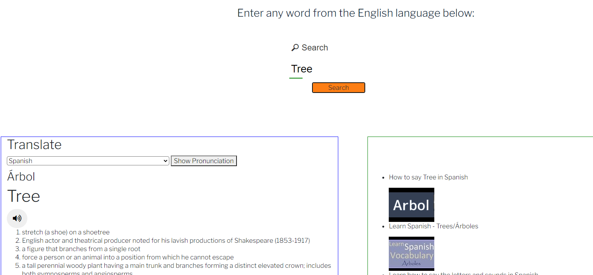

# DefineHub Description

DefineHub is going to be a website based off of an in-depth explanation of the word of your choosing. Ex: definition, synonyms, pronunciation, origin, and more detailed information about the word.

DefineHub will allow you to pick a word of any language and it will display all information about said word. This will use the WordAPI to obtain the dictionary information of the word.

Involved will be the youtubeAPI to show a list of videos pulled from youtube on how to properly pronounce the word you choose. as an extra we are wanting to include a mapAPI to show where the word has originated from IF that information is accessible.

<br>

# User Story

```
AS an END User
I WANT to discover and understand the etymology of words
SO THAT I can increase my daily vocabulary in a meaningful way
```

<br>

# Deploy Link

```
https://jordandub1.github.io/DefineHub/
```

<br>

# Getting Started

#### Landing Page


#### Search Word Page


#### Word Definition, Translation, and YouTube Videos



<br>

## Usage Tips

1. Navigate to the DefineHub using below link

```
https://jordandub1.github.io/DefineHub/
```

2. Click <b>"Start Here!"</b> button to search for the Word

- If would like to learn about the API's, Translation Services, YouTube you can use Nav bar to navigate to specific documentation along with Project GitHub Repo.

3. After you have typed your "Word" click on <b>Search button</b> to display Word, it's definition, and English SpeechSynthesis.

4. If you would like to translate your word in to a different language use <b>Translate Dropdown</b> and select the desire language.

5. If you would like to learn translated word pronunciation click on <b>Show Pronunciation</b> and YouTube videos will be available which teaches you the pronunciation.

---

## API Reference

- [Words API](https://www.wordsapi.com/)

- [Map API](https://developer.mapquest.com/)

- [Translate API](https://libretranslate.com/)

- [YouTube API](https://developers.google.com/youtube/documentation)

- [SpeechSynthesis](https://developer.mozilla.org/en-US/docs/Web/API/SpeechSynthesis)

<br>

---

## Technology

- [HTML]()
- [CSS]()
- [JavaScript]()

  ### Library

- [BootStrap](https://getbootstrap.com/)
- [Animate On Scroll](https://michalsnik.github.io/aos/)

---

## Team

- [Jordan DuBose](https://github.com/jordandub1)

- [Angela ](https://github.com/aakrider)

- [Steven Sosebee](https://github.com/steven-sosebee)

- [Timothy Copley](https://github.com/Alex-copley)

- [Hardik Rola](https://github.com/hrsautomation20)
